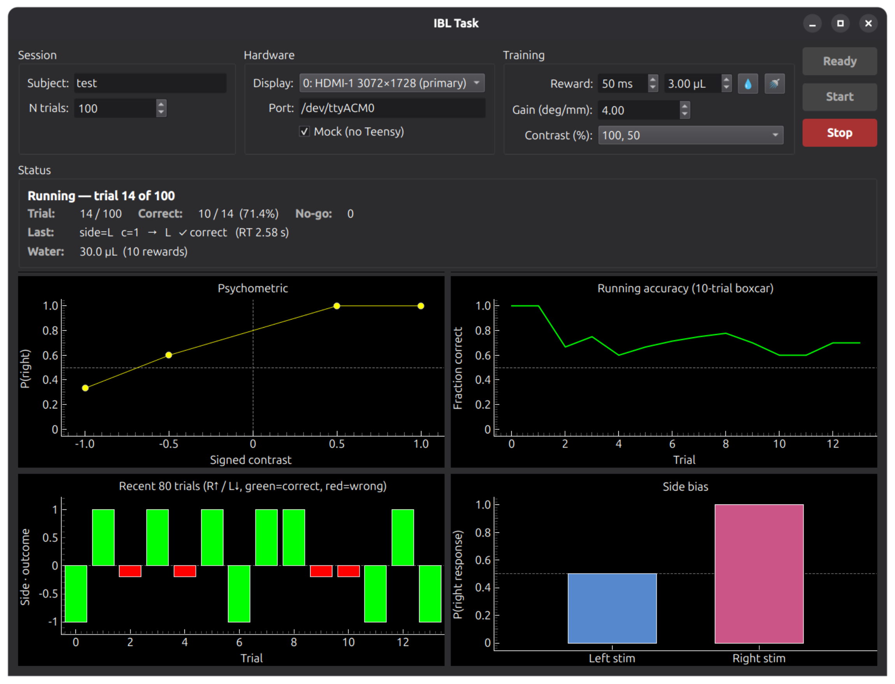

# ibl-task

POSTECH NCTRL implementation of the IBL **trainingChoiceWorld** visual
2-alternative forced-choice task for head-fixed mice. The stimulus and trial
flow follow the IBL specification (Appendix 2 in `docs/`); hardware control
runs on a Teensy 4.x and is driven by Python via a 3-byte serial protocol at
1 kHz.

<p align="center">
  
  
</p>

## Install

```bash
conda create -n ibl python=3.10
conda install -n ibl -c conda-forge pyqt wxpython
conda run -n ibl pip install psychopy
conda run -n ibl pip install -e .
```

Flash `teensy/teensy.ino` to a Teensy 4.x with an Audio Shield using the
Arduino IDE + Teensyduino (requires the `Encoder` and `Audio` libraries).

## Wiring

The Teensy emits a TTL pulse on a dedicated pin for each behavioral event so
that trial alignment is recorded in hardware alongside neural data. Connect
each pin to one digital input channel on the recording device and tie a Teensy
`GND` pin to the recording device's digital ground.

| Teensy pin | Signal     | Goes HIGH on              | Goes LOW on              |
|------------|------------|---------------------------|--------------------------|
| 2          | TRIAL      | `t` (trial onset)         | `T` (trial offset)       |
| 3          | CUE        | `c` (cue onset)           | `C` (cue offset)         |
| 4          | NOISE      | `n` (incorrect feedback)  | auto after 500 ms        |
| 5          | REWARD     | `r` (valve open)          | auto after reward (ms)   |
| — (DAQ AI) | LICK       | lickometer (analog)       | —                        |
| — (DAQ AI) | PHOTODIODE | screen photodiode (analog)| —                        |

Logic level is 3.3 V (Teensy 4.x is **not** 5 V-tolerant on inputs, but the
outputs above are read-only by the DAQ so this only matters in one direction).

- **NI DAQ** (e.g. PXIe-6341, USB-6363): wire each pin to a `PFI`/`P0.x`
  digital input and Teensy `GND` to `D GND`. NI digital inputs are TTL and
  accept 3.3 V as logic HIGH.
- **TDMS-logged DAQ** (any system that streams to NI-TDMS files, e.g.
  LabVIEW + cDAQ): same wiring as NI above; record the four lines as a
  digital waveform channel so edges land in the `.tdms` file with the same
  clock as the neural stream.

The pin assignments live at the top of `teensy/teensy.ino`
(`TRIAL` / `CUE` / `NOISE` / `REWARD`); change them there if your harness
needs a different pinout. Pins reserved by the Audio Shield
(`6 7 8 10 11 12 13 15 18 19 20 21 23`) must not be reused.

## Photodiode interpretation

The `CUE` TTL marks the software request to flip the stimulus, but the actual
photons reach the eye later because LG LCD panels refresh top-to-bottom over
roughly one frame (~16 ms at 60 Hz). Treat the photodiode rising edge — not
the `CUE` edge — as the true stimulus onset, and expect the lag between them
to depend on where the photodiode patch sits on the screen:

- **Top of screen:** photodiode rises **0–16 ms** after the `CUE` edge.
- **Bottom of screen:** photodiode rises **16–32 ms** after the `CUE` edge
  (one full top-to-bottom sweep plus up to one frame of scheduling jitter).

Place the photodiode in a fixed, documented location across sessions so this
offset is constant per rig. For sub-frame alignment, use the photodiode
timestamp directly; the `CUE` TTL is fine for trial-level alignment but will
systematically lead the visual onset by the offsets above.

## Run

```bash
ibl                        # launch the GUI
```

In the GUI, set Subject, Port (`/dev/ttyACM0` by default), N trials, Reward
(ms), Gain (deg/mm), and Contrast tiers, then press **Start**. **Esc** in the
PsychoPy window stops the session cleanly. Tick **Mock** to drive the wheel
with ← / → arrow keys when no Teensy is connected.

Optional — install a clickable desktop/menu launcher (Linux only):

```bash
python tools/install_desktop_entry.py
```

This places an "IBL task" entry in the application menu and a double-clickable
icon on the Desktop folder. On GNOME you may need to right-click the desktop
icon once and choose **Allow Launching**.

## Output

Each session writes to `./<subject>_<YYYY-MM-DD_HH-MM-SS>/`:

- `trials.csv` — one row per trial: index, signed contrast, side (-1 = left,
  +1 = right), response, correct, response time, event timestamps, reward (ms).
- `stream.npz` — per-frame arrays: `t`, `gabor_x_deg`, `wheel_pos_deg`,
  `wheel_speed_deg_s`.

## Per-rig calibration

`WHEEL_GAIN_DEG_PER_MM` in `ibl/config.py` is the visual degrees the Gabor
moves per mm of wheel surface travel. IBL default is 4.0; it can be overridden
in the GUI per session.

Reward valve-open time (ms) and dispensed water (µL) are kept **independent**:
`ms` controls the hardware, `µL` is the experimenter-measured volume that gets
logged per trial and summed in the live **Water** readout. Calibrate them both
manually for each rig.

## License

MIT — see `LICENSE`.
